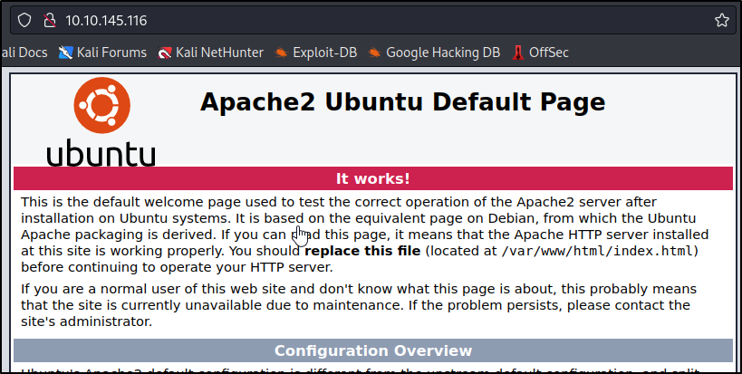
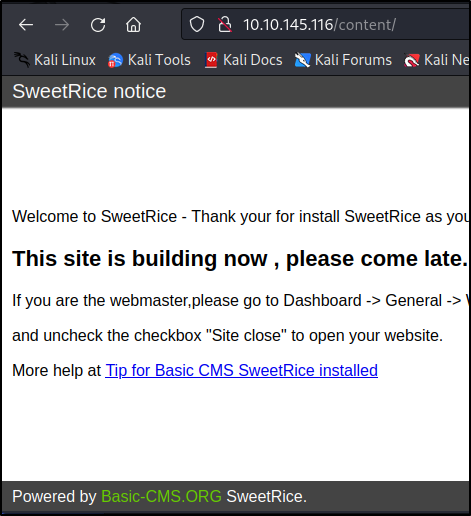
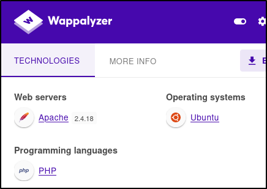
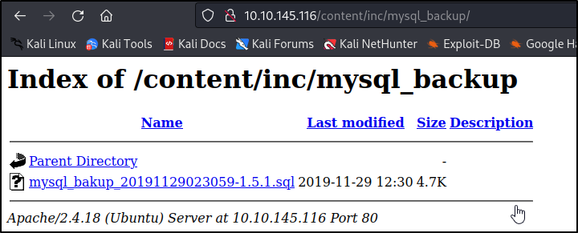
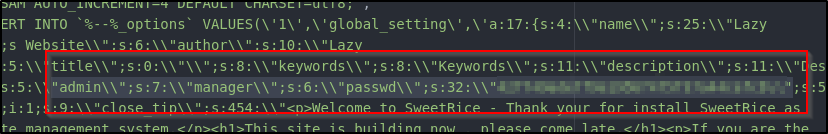
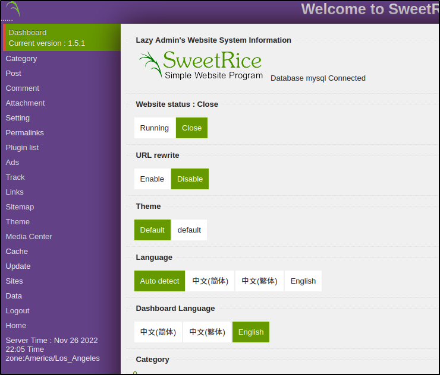

Reference: https://tryhackme.com/room/lazyadmin

This is going to be a quick walkthrough and brain dump of my experience going through THM LazyAdmin. I am not above using hints. This is all a growing and learning experience for me. 

First thing's first lets go ahead and hit it with an NMAP Scan.

```
┌──(kali㉿kali)-[~]
└─$ nmap -sV 10.10.145.116 
Starting Nmap 7.93 ( https://nmap.org ) at 2022-11-26 23:48 EST
Nmap scan report for 10.10.145.116
Host is up (0.22s latency).
Not shown: 998 closed tcp ports (conn-refused)
PORT   STATE SERVICE VERSION
22/tcp open  ssh     OpenSSH 7.2p2 Ubuntu 4ubuntu2.8 (Ubuntu Linux; protocol 2.0)
80/tcp open  http    Apache httpd 2.4.18 ((Ubuntu))
Service Info: OS: Linux; CPE: cpe:/o:linux:linux_kernel

Service detection performed. Please report any incorrect results at https://nmap.org/submit/ .
Nmap done: 1 IP address (1 host up) scanned in 34.91 seconds
```

We see an Apache Server over port 80. That looks like some fun. Let's go do some normal recon on the website and see what we can see or access. 



I decided to check is there was a robots.txt next but, no avail. Lets move onto checking for any common web directories.

```
─$ sudo nmap -v -sS -T4 10.10.145.116 -p80 --script=http-enum 
--SNIP--
PORT   STATE SERVICE
80/tcp open  http
| http-enum: 
|_  /content/: Potentially interesting folder
--SNIP
```

There seems to be a content directory which is worth some investigations. 



I decided to enumerate the pages a little more but, not a whole lot. Little more recon on Wappalyzer hints at the website being PHP.



I did a couple google searchs and it was filled with writeups. I may have had to get a hint and noticed someone used "searchsploit"

```
msf6 > searchsploit SweetRice
[*] exec: searchsploit SweetRice

------------------------------------------------------------------------------------------------------------------------ ---------------------------------
 Exploit Title                                                                                                          |  Path
------------------------------------------------------------------------------------------------------------------------ ---------------------------------
SweetRice 0.5.3 - Remote File Inclusion                                                                                 | php/webapps/10246.txt
SweetRice 0.6.7 - Multiple Vulnerabilities                                                                              | php/webapps/15413.txt
SweetRice 1.5.1 - Arbitrary File Download                                                                               | php/webapps/40698.py
SweetRice 1.5.1 - Arbitrary File Upload                                                                                 | php/webapps/40716.py
SweetRice 1.5.1 - Backup Disclosure                                                                                     | php/webapps/40718.txt
SweetRice 1.5.1 - Cross-Site Request Forgery                                                                            | php/webapps/40692.html
SweetRice 1.5.1 - Cross-Site Request Forgery / PHP Code Execution                                                       | php/webapps/40700.html
SweetRice < 0.6.4 - 'FCKeditor' Arbitrary File Upload                                                                   | php/webapps/14184.txt
------------------------------------------------------------------------------------------------------------------------ ---------------------------------
Shellcodes: No Results
```

Looking through the options on one of them seemed feasible as we would have to have found the dashboard or something to exploit the others so I dug into the Backup Disclosure exploit. 

```
msf6 > searchsploit -p 40718
[*] exec: searchsploit -p 40718

  Exploit: SweetRice 1.5.1 - Backup Disclosure
      URL: https://www.exploit-db.com/exploits/40718
     Path: /usr/share/exploitdb/exploits/php/webapps/40718.txt
File Type: ASCII text
```

This tells us that you can access the backups from thje /inc/mysql_backup. Sure enough the backup is right in that directory. 



Opening up the DB into my text editor, Atom, and parsing through the information I found a section with what could potentially be admin credentials. It "appears" to be md5 but, tossed into CrackStation just to check. 



Bingo! CrackStation was able to identify and crack. Ironically not a strong password. No clue where I could use it but, keeping for safe keeping. I remember it having ssh open so I decided to try it against admin, manager, and root. No Luck.

Let's try another method of directory scanning. Let's do some more into Content since it seems to be the hot commodity.

```
┌──(kali㉿kali)-[~]
└─$ dirsearch -u 10.10.145.116/content -t 100 -w /usr/share/dirbuster/wordlists/directory-list-2.3-medium.txt 
```

Sure enough we get more results this way

```
┌──(kali㉿kali)-[~]
└─$ dirsearch -u 10.10.145.116/content -t 100 -w /usr/share/dirbuster/wordlists/directory-list-2.3-medium.txt 

  _|. _ _  _  _  _ _|_    v0.4.2
 (_||| _) (/_(_|| (_| )
                                                                                                                                                          
Extensions: php, aspx, jsp, html, js | HTTP method: GET | Threads: 100 | Wordlist size: 220545

Output File: /home/kali/.dirsearch/reports/10.10.145.116-content_22-11-27_01-00-50.txt

Error Log: /home/kali/.dirsearch/logs/errors-22-11-27_01-00-50.log

Target: http://10.10.145.116/content/

[01:00:50] Starting: 
[01:00:54] 301 -  323B  - /content/images  ->  http://10.10.145.116/content/images/
[01:00:59] 301 -  319B  - /content/js  ->  http://10.10.145.116/content/js/
[01:01:03] 301 -  320B  - /content/inc  ->  http://10.10.145.116/content/inc/
[01:01:07] 301 -  319B  - /content/as  ->  http://10.10.145.116/content/as/
[01:01:08] 301 -  324B  - /content/_themes  ->  http://10.10.145.116/content/_themes/
[01:01:08] 301 -  327B  - /content/attachment  ->  http://10.10.145.116/content/attachment/
```

I know from manually digging that not much is in /images, /js, /inc, /_themes. So decided to check out /as.

Bingo a Login Page. Decided to try out the password we got earlier as Manager and "Password". Looks like we are in. 



I decided to do some digging around. Noticed you could add code into the Ads section.